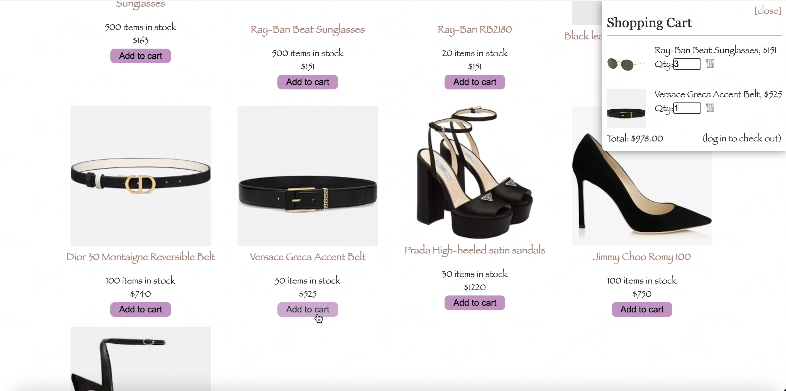
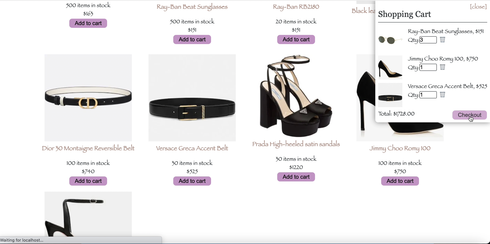
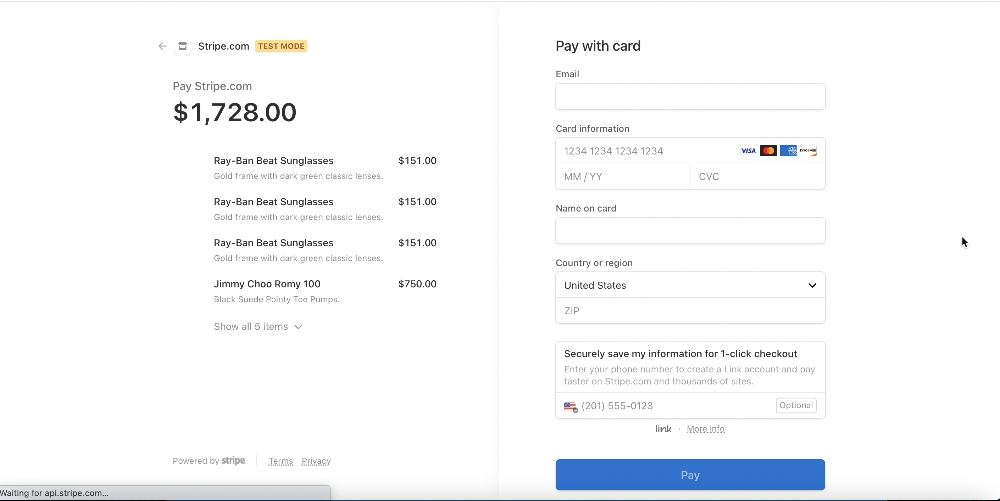
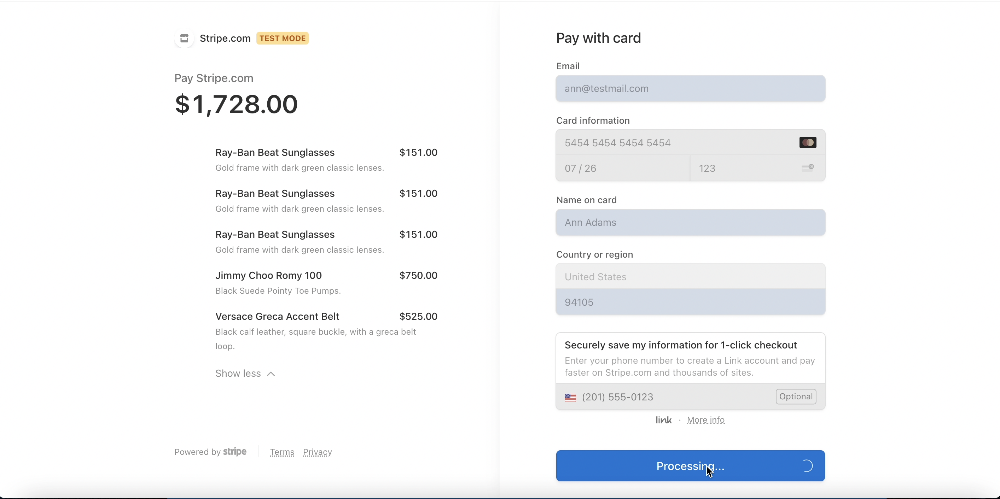
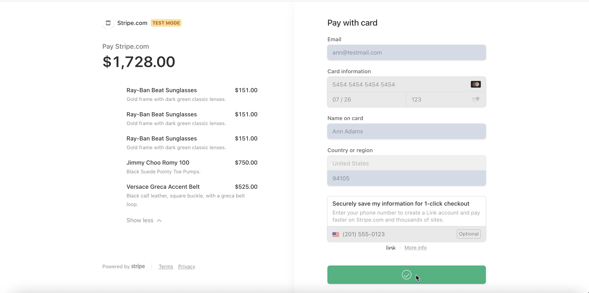
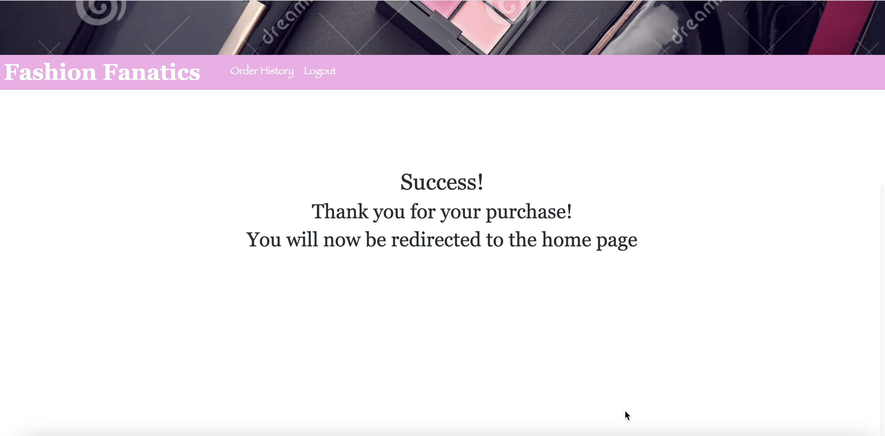
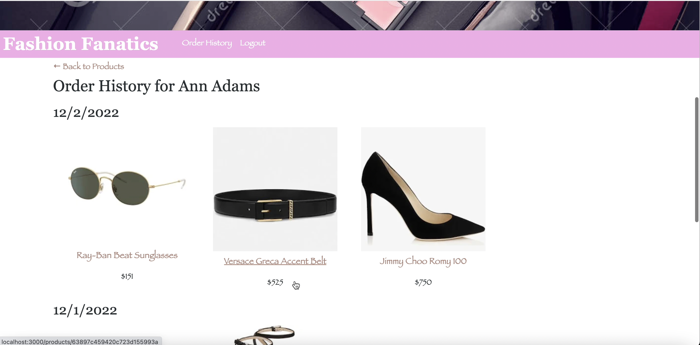
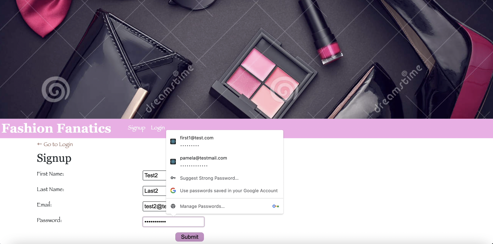
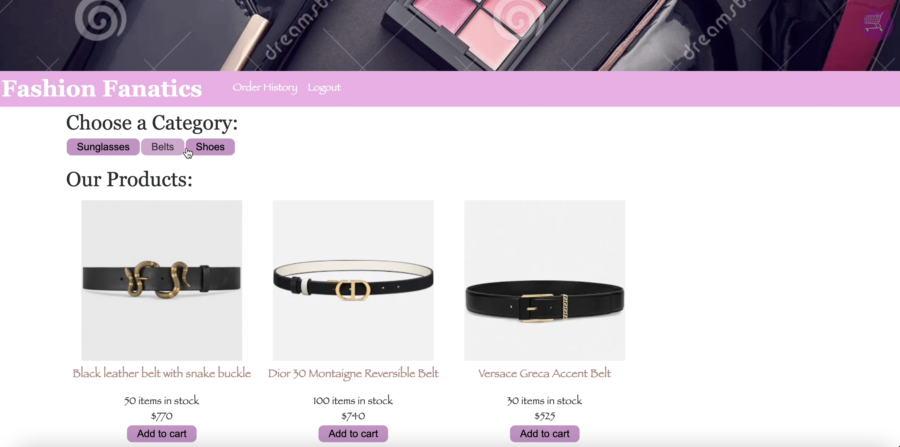
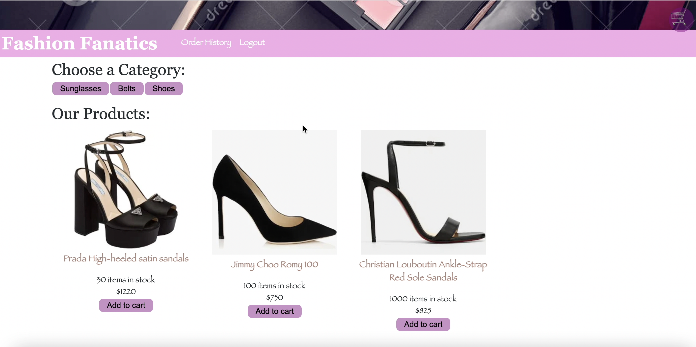

# Fashion-Fanatics


## User Story

```md
As a fashion lover, I want to be able to have a single stop shop for all the accessories. If you are a fashion fanatic, you will love this app.
```

## Description
FashionFantatics is an ecommerce application meant for browsing and purchasing high-end women's accessories. This application allows you to filter by product category, add products to cart, manage the desired product quantity in the cart, checkout a purchase, and view order history. This application is a MERN stack application using MongoDB, Node.js, GraphQL, Apollo Server, React, as well as Stripe for the checkout process.

## Table of Contents
* [Deployed Application](#deployed-application)
* [User Story](#user-story)
* [Usage](#usage)
* [License](#license)
* [Available-Scripts](#available-scripts)
* [Learn-More](#learn-more)
* [Contributing](#contributing)
* [Questions](#questions)

## Deployed Application
[FashionFanatics] (insert heroku link here) <br />
! [Image] (github screenshot) <br />

## User Story
AS a consumer looking for a website that display women's high end accessories<br />
I WANT to be able to browse, add to cart, and checkout<br />
SO THAT I can purchase accessories of my choosing<br />


## Usage 

This application allows the user to signup or login into an account, browse the categories of accessories, add products to cart, manage the quantities of products in the shopping cart, checkout a purchase, and be able to view their purchase history.

## License

This project is licensed under the MIT.

## Available Scripts

In the project directory you can run:

### `npm start`

Runs the app in the development mode.<br />
Open [http://localhost:3000](http://localhost:3000) to view it in the browser.

The page will reload if you make edits.<br />
You will also see any lint errors in the console.

### `npm test`

Launches the test runner in the interactive watch mode.<br />
See the section about [running tests](https://facebook.github.io/create-react-app/docs/running-tests) for more information.

### `npm run build`

Builds the app for production to the `build` folder.<br />
It correctly bundles React in production mode and optimizes the build for the best performance.

The build is minified and the filenames include the hashes.<br />
Your app is ready to be deployed!

See the section about [deployment](https://facebook.github.io/create-react-app/docs/deployment) for more information.

### `npm run eject`

**Note: this is a one-way operation. Once you `eject`, you can’t go back!**

If you aren’t satisfied with the build tool and configuration choices, you can `eject` at any time. This command will remove the single build dependency from your project.

Instead, it will copy all the configuration files and the transitive dependencies (webpack, Babel, ESLint, etc) right into your project so you have full control over them. All of the commands except `eject` will still work, but they will point to the copied scripts so you can tweak them. At this point you’re on your own.

You don’t have to ever use `eject`. The curated feature set is suitable for small and middle deployments, and you shouldn’t feel obligated to use this feature. However we understand that this tool wouldn’t be useful if you couldn’t customize it when you are ready for it.

## Learn More

You can learn more in the [Create React App documentation](https://facebook.github.io/create-react-app/docs/getting-started).

To learn React, check out the [React documentation](https://reactjs.org/).

### Code Splitting

This section has moved here: https://facebook.github.io/create-react-app/docs/code-splitting

### Analyzing the Bundle Size

This section has moved here: https://facebook.github.io/create-react-app/docs/analyzing-the-bundle-size

### Making a Progressive Web App

This section has moved here: https://facebook.github.io/create-react-app/docs/making-a-progressive-web-app

### Advanced Configuration

This section has moved here: https://facebook.github.io/create-react-app/docs/advanced-configuration

### Deployment

This section has moved here: https://facebook.github.io/create-react-app/docs/deployment

### `npm run build` fails to minify

This section has moved here: https://facebook.github.io/create-react-app/docs/troubleshooting#npm-run-build-fails-to-minify


## Contributing

Dina Eissa, Joshua Nelson, Nirali Parmar, Rachael Bailey, Noah Westberry

The app is successfully deployed to Heroku.

The link to heroku app is:

https://young-reaches-17728.herokuapp.com/


## Screenshots














